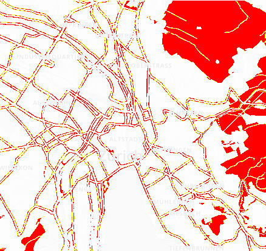
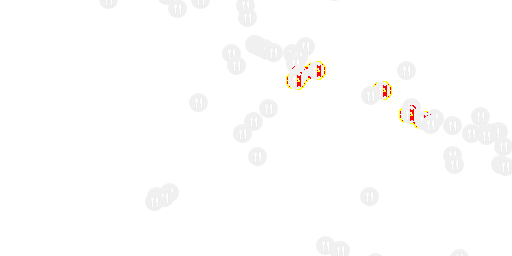

# pixelmatch-rs

Pixel-level image comparison

Completely based on [`pixelmatch`][].

[`pixelmatch`]: https://github.com/mapbox/pixelmatch

```rs
let num_diff_pixels = pixelmatch(
    im1,
    img2,
    diff,
    None,
    None,
    Some(Options {
        threshold: 0.1,
        ..Default::default()
    }),
);
```

Implements ideas from the following papers:

- [Measuring perceived color difference using YIQ NTSC transmission color space
  in mobile applications](http://www.progmat.uaem.mx:8080/artVol2Num2/Articulo3Vol2Num2.pdf)
  (2010, Yuriy Kotsarenko, Fernando Ramos)
- [Anti-aliased pixel and intensity slope detector](https://www.researchgate.net/publication/234126755_Anti-aliased_Pixel_and_Intensity_Slope_Detector)
  (2009, Vytautas Vyšniauskas)

## Example output

| expected | actual | diff |
| --- | --- | --- |
|  |  |  |
|  |  |  |
|  |  |  |

## Command line

Pixelmatch comes with a binary that works with PNG images:

```bash
pixelmatch --threshold 0.1 image1.png image2.png output.png
```
